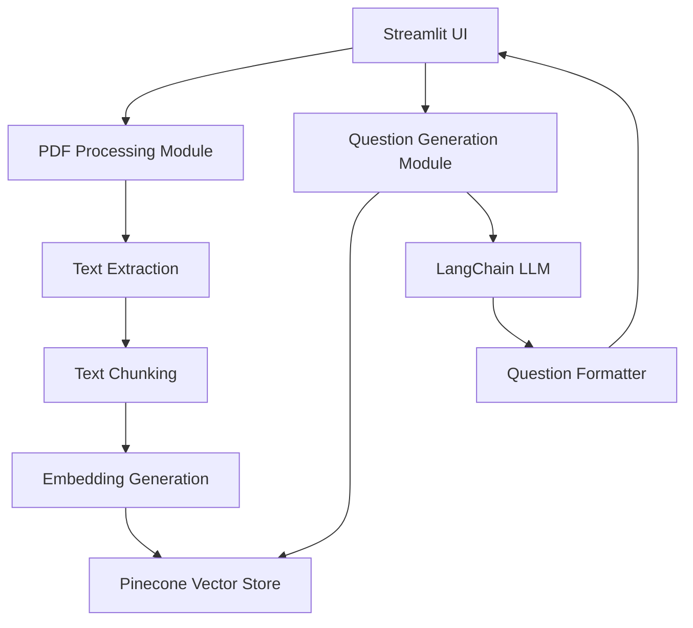

# Quiz Generator Design Document

## Overview

The Quiz Generator is a Streamlit-based web application that leverages LangChain and Pinecone to automatically generate quiz questions from PDF documents. The system extracts text from uploaded PDFs, creates vector embeddings for semantic search, and uses AI to generate contextually relevant multiple-choice questions.

## Architecture

The application follows a modular architecture with clear separation of concerns:



### Key Components

1. **Streamlit UI Layer**: Handles user interactions, file uploads, and display
2. **PDF Processing Module**: Extracts and prepares content for vectorization
3. **Vector Storage Layer**: Manages Pinecone integration for semantic search
4. **Question Generation Module**: Orchestrates LLM-based question creation
5. **Configuration Module**: Manages API keys and system settings

## Components and Interfaces

### 1. Streamlit UI Component

**Responsibilities:**
- File upload handling
- User input collection (number of questions)
- Display generated questions and answers
- Error message presentation
- Session state management

**Key Functions:**
```python
def render_upload_section() -> UploadedFile
def render_question_count_input() -> int
def render_generate_button() -> bool
def display_questions(questions: List[Question]) -> None
def display_error(message: str) -> None
```

### 2. PDF Processing Module

**Responsibilities:**
- PDF text extraction
- Text chunking with overlap
- Metadata extraction (page numbers, document info)

**Key Classes:**
```python
class PDFProcessor:
    def extract_text(pdf_file: UploadedFile) -> str
    def chunk_text(text: str, chunk_size: int, overlap: int) -> List[DocumentChunk]
    def extract_metadata(pdf_file: UploadedFile) -> Dict
```

**Configuration:**
- Chunk size: 1000 characters
- Chunk overlap: 200 characters
- Uses PyPDF2 or pdfplumber for extraction

### 3. Vector Store Module

**Responsibilities:**
- Initialize Pinecone connection
- Create and manage indexes
- Store document embeddings
- Retrieve relevant chunks for question generation

**Key Classes:**
```python
class VectorStoreManager:
    def __init__(api_key: str, environment: str, index_name: str)
    def initialize_index(dimension: int) -> None
    def store_embeddings(chunks: List[DocumentChunk], embeddings: List[Vector]) -> None
    def similarity_search(query: str, k: int) -> List[DocumentChunk]
    def clear_index() -> None
```

**Pinecone Configuration:**
- Index dimension: 1536 (OpenAI ada-002 embeddings)
- Metric: cosine similarity
- Namespace: document-specific or session-based

### 4. Embedding Module

**Responsibilities:**
- Generate embeddings using LangChain
- Interface with OpenAI or other embedding models

**Key Classes:**
```python
class EmbeddingGenerator:
    def __init__(model_name: str)
    def generate_embeddings(texts: List[str]) -> List[Vector]
    def generate_query_embedding(query: str) -> Vector
```

**Configuration:**
- Default model: OpenAI text-embedding-ada-002
- Batch processing for efficiency

### 5. Question Generation Module

**Responsibilities:**
- Retrieve relevant context from vector store
- Generate questions using LLM
- Format questions with multiple choice options
- Validate question quality

**Key Classes:**
```python
class QuestionGenerator:
    def __init__(llm: BaseLLM, vector_store: VectorStoreManager)
    def generate_questions(num_questions: int, document_context: str) -> List[Question]
    def format_question(raw_output: str) -> Question
    def validate_question(question: Question) -> bool

class Question:
    question_text: str
    options: List[str]  # 4 options
    correct_answer: int  # index of correct option
    source_context: str
```

**LLM Prompt Strategy:**
```
Given the following context from a document, generate {n} multiple-choice questions.
Each question should:
- Test understanding of key concepts
- Have 4 options (A, B, C, D)
- Have exactly one correct answer
- Be clear and unambiguous

Context: {context}

Format each question as:
Question: [question text]
A) [option 1]
B) [option 2]
C) [option 3]
D) [option 4]
Correct Answer: [A/B/C/D]
```

### 6. Configuration Module

**Responsibilities:**
- Load environment variables
- Validate API keys
- Manage application settings

**Key Functions:**
```python
def load_config() -> Config
def validate_api_keys() -> bool
def get_openai_key() -> str
def get_pinecone_key() -> str
```

## Data Models

### DocumentChunk
```python
@dataclass
class DocumentChunk:
    id: str
    text: str
    metadata: Dict[str, Any]  # page_number, document_name, chunk_index
    embedding: Optional[List[float]]
```

### Question
```python
@dataclass
class Question:
    id: str
    question_text: str
    options: List[str]  # Always 4 options
    correct_answer_index: int  # 0-3
    source_context: str
    difficulty: Optional[str]  # easy, medium, hard
```

### AppConfig
```python
@dataclass
class AppConfig:
    openai_api_key: str
    pinecone_api_key: str
    pinecone_environment: str
    pinecone_index_name: str
    chunk_size: int = 1000
    chunk_overlap: int = 200
    max_questions: int = 20
    min_questions: int = 1
```

## Error Handling

### Error Categories

1. **File Upload Errors**
   - Invalid file format
   - File too large
   - Corrupted PDF
   - Action: Display user-friendly error, allow retry

2. **PDF Processing Errors**
   - Text extraction failure
   - Empty document
   - Action: Log error, display message, suggest alternative PDF

3. **Vector Store Errors**
   - Connection failure
   - API key invalid
   - Index not found
   - Action: Display connection error, check configuration

4. **Question Generation Errors**
   - LLM API failure
   - Rate limiting
   - Invalid response format
   - Action: Retry with exponential backoff, display error if persistent

5. **Validation Errors**
   - Invalid question count
   - Missing required fields
   - Action: Display validation message, prevent submission

### Error Handling Strategy

```python
class ErrorHandler:
    @staticmethod
    def handle_pdf_error(error: Exception) -> str:
        # Log and return user-friendly message
        
    @staticmethod
    def handle_vector_store_error(error: Exception) -> str:
        # Check connection, return actionable message
        
    @staticmethod
    def handle_generation_error(error: Exception, retry_count: int) -> str:
        # Implement retry logic, return status
```

## Testing Strategy

### Unit Tests

1. **PDF Processing Tests**
   - Test text extraction from sample PDFs
   - Test chunking logic with various text sizes
   - Test metadata extraction

2. **Vector Store Tests**
   - Mock Pinecone API calls
   - Test embedding storage and retrieval
   - Test similarity search functionality

3. **Question Generation Tests**
   - Test prompt formatting
   - Test question parsing from LLM output
   - Test validation logic

### Integration Tests

1. **End-to-End Flow**
   - Upload PDF → Process → Generate Questions
   - Test with various PDF formats and sizes
   - Verify question quality and format

2. **Error Scenarios**
   - Test with invalid PDFs
   - Test with missing API keys
   - Test with network failures

### Manual Testing

1. **UI/UX Testing**
   - Test file upload flow
   - Test question display and answer reveal
   - Test error message clarity

2. **Quality Testing**
   - Evaluate generated question relevance
   - Check answer correctness
   - Assess question difficulty distribution

## Implementation Notes

### Dependencies

```
streamlit>=1.28.0
langchain>=0.1.0
pinecone-client>=3.0.0
openai>=1.0.0
pypdf2>=3.0.0
python-dotenv>=1.0.0
```

### Environment Variables

```
OPENAI_API_KEY=<your-key>
PINECONE_API_KEY=<your-key>
PINECONE_ENVIRONMENT=<environment>
PINECONE_INDEX_NAME=quiz-generator
```

### Session State Management

Streamlit session state will track:
- Uploaded PDF file
- Processed document chunks
- Generated questions
- Show/hide answers toggle
- Error messages

### Performance Considerations

- Batch embedding generation for efficiency
- Cache processed PDFs in session state
- Limit concurrent API calls
- Implement progress indicators for long operations
